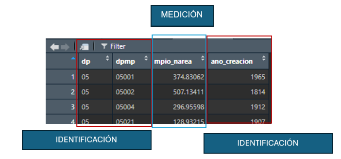
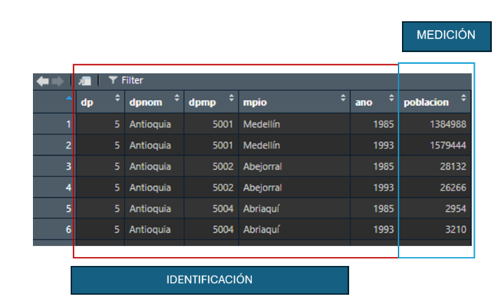

```{r Setup, include=FALSE}
# --- Limpiar entorno
rm(list = ls())
gc()
closeAllConnections()

# --- Cargar librerías necesarias
library("pacman")
require("pacman")
p_load( tidyverse, data.table, lubridate, readxl, ggthemes, plotly, janitor,ggplot2)

# --- Definir rutas
user <- Sys.getenv("USERNAME")

if (user == "judel") {
  path <- file.path("C:/Users", "judel", "OneDrive", "Documentos", 
                    "ANDES", "Semestre 3", "Visualizacion de datos", "Actividad 1")
} else if (user == "mvill") {
  path <- file.path("C:/Users", "mvill", "OneDrive", "Transitorio", "OneDrive", 
                    "Documentos", "GitHub", "Visualizaci-n-UniAndes")
} else if (user == "hncar") {
  path <- file.path("C:/Users", "hncar", "Documents", "GitHub", "Visualizaci-n-UniAndes")
} else {
  path <- choose.dir(caption = "Selecciona la carpeta con los archivos")
}

setwd(path)

# --- Cargar datos 
file_area      <- file.path(path, "data/mun_area.csv")
file_poblacion <- file.path(path, "data/pob_censal.xlsx")

mun_area   <- read_csv(file_area) %>% clean_names()
pob_censal <- read_excel(file_poblacion, sheet = 1) %>% clean_names()
```

## Entendimiento de los datos

1. Identifique y justifique la *unidad de observación* en cada tabla de datos 
suministrados

- **mun_area**: 
  Este archivo es un documento en formato csv que permite guardar información en un  texto plano, 
  donde los datos se guardan en filas y columnas separadas por comas u otro separador. Este 
  formato permite guardar una gran cantidad de información ocupando menos espacio que un excel regular, 
  además de ser compatible por muchos otros tipos de programa para lograr leerlos. Con respecto a los datos
  que contiene, cada fila describe para un municipio en Colombia, identificado por la llave única dpmp.
  Este identificador corresponde al codigo DIVIPOLA, que es el sistema de codificacion de la division 
  politica - administrativa de los departamentos y municipios en el territorio nacional, creado por el DANE.
  Además, presenta información sobre su área, el departamento al que pertenece, el año en que fue creado. 

- **pob_censal**: 
  A diferencia del archivo anterior, este es un archivo xlsx que correponde al formato regular de los archivos excel.
  Este permite observar los datos desde una hoja de datos, facilitando su visualizacion y manejo, aunque implicando un
  mayor peso de almacenaiento. Cada fila describe para un municipio en Colombia, identificado por la llave única dpmp.
  Esta llave tambien corresponde al codigo unico DIVIPOLA, por lo que desde este punto es importante asegurar que esta
  columna este correctaente leida y con un formato correcto para poder realizar el cruce con la tabla mun-area.
  Además, la tabla tambien presenta información sobre la población de dicho municipio, el departamento al que 
  pertenece y su nombre; así cómo el año al que pertenece la información de población.

```{r Resumen}
summary(mun_area)
summary(pob_censal)
```

2. Clasifique cada variable como identificación o medición; indique tipo y 
formato.

| Municipios                          | Población                           |
|-------------------------------------|-------------------------------------|
| {width=300px} | {width=350px} |

- **mun_area**: dp, dpmp  son tipo caracter mientras que mpio_narea y ano_creación tipo numérico (64 bits).
- **pob_censal**: dpnom, mpio  son tipo caracter mientras que dp, poblacion, dpmp, ano son tipo numérico (64 bits). 

```{r Tipo y formato}
sapply(mun_area, class)
sapply(pob_censal, class)
```

3. Proponga al menos 3 reglas mínimas de consistencia para asegurar la calidad de 
los datosde las variables disponibles y que constituyen parte de la documentación 
del ejercicio.

- **Regla 1**: La variable dp debe ser igual para cualquier municipio entre las bases de datos. 
  (Asumiendo que los municipios no se relocalizan sobre otros departamentos).
- **Regla 2**: La población debe ser mayor a cero para el año en que se reporta.
- **Regla 3**: El área de un municipio debe siempre ser mayor a cero.
- **Regla 4**: Las ciudades capitales deben concentrar más población en cada departamento. 
- **Regla 5**: Los años con censo son: 1985,1993,2005 o 2018.


## Preparación de los datos 

1. Construya la llave única para la tabla de población (sugerencia: DPMP + AÑO).

```{r 1. Preparación de datos y creación de llaves}
# --- pob_censal ---
pob_censal <- pob_censal %>%
  mutate(
    dpmp = sprintf("%05d", as.integer(dpmp)),   # código municipal 5 dígitos
    dp   = sprintf("%02d", as.integer(dp)),     # código depto 2 dígitos
    ano = as.integer(ano),
    poblacion = as.integer(poblacion),
    llave = paste0(dpmp, "_", ano)              # llave única
  )

if ("dpnom" %in% names(pob_censal)) {
  pob_censal <- pob_censal %>%
    mutate(dpnom = tolower(iconv(dpnom, from = "UTF-8", to = "ASCII//TRANSLIT")))
}

# --- mun_area ---
mun_area <- mun_area %>%
  rename(ano = ano_creacion) %>%   # renombrar columna
  mutate(
    dpmp = sprintf("%05d", as.integer(dpmp)),
    dp   = sprintf("%02d", as.integer(dp)),
    ano  = as.integer(ano),             # ahora ya está como ano
    llave = paste0(dpmp, "_", ano)      # misma llave que pob_censal
  )
```

2. Verifique duplicados; reporte conteos y la decisión de tratamiento. 
- **Respuesta**: Dado que no se presentan duplicados o valores vacíos, no se aplica tratamiento.

```{r 2. Duplicados y vacíos}
# --- Verificar valores vacíos
cat("\n--- Número de NA's por columna en mun_area ---\n")
sapply(pob_censal, function(x) sum(is.na(x)))
cat("\n--- Número de NA's por columna en pob_censal ---\n")
sapply(mun_area, function(x) sum(is.na(x)))

# --- Verificar duplicados

# --- Población censal ---
duplicados_pob <- pob_censal %>% count(llave) %>% filter(n > 1)

cat("\n>>> Verificación de duplicados en pob_censal <<<\n")
if (nrow(duplicados_pob) > 0) { print(duplicados_pob)} else { cat("No se encontraron duplicados en pob_censal.\n")}

# --- Municipios / áreas ---
duplicados_area <- mun_area %>% count(llave) %>% filter(n > 1)

cat("\n>>> Verificación de duplicados en mun_area <<<\n")
if (nrow(duplicados_area) > 0) { print(duplicados_area)
} else { cat("No se encontraron duplicados en mun_area.\n") }

rm(duplicados_pob, duplicados_area)
```

3. Explique qué tipo de unión tendrían las tablas disponibles y por qué.

- **Respuesta**: Si no quisieramos perder nada de información 
  debería realizarse un outer join usando la llave creada anteriormente; en tanto es la manera en que preservamos 
  más información sobre los municipios en cada año.Esto es: dado que las bases de datos solo 
  comparten los años 1985 y 1993; pero comparten casi todos los municipios (exceptuando el 94663
  solo disponible en población censal) podemos tener una base de datos única que 
  contemple toda la información disponible en pob_censal y se complente 
  con información relacionada al área del municipio para los años disponibles. 
  
  Sin embargo, consiiderando que solo comparten 17 observaciones (Municipios y años comunes)
  podría ser de interés solo preservar la data de población censal y agregar, para los años 
  disponibles, el área de los 17 municipios en común. Lo anterior puede realziarse con un 
  left join o right join.
  
  Además, procuramos preservar el formato long dado que este formato favorece la manipulación
  de la infomración para el análisis descriptivo. 

```{r 3. Análisis unión, echo=FALSE, message=FALSE}
# ==========================================================
# Comparación de años
# ==========================================================
anos_pob   <- sort(unique(pob_censal$ano))
anos_area  <- sort(unique(mun_area$ano))

anos_comunes    <- intersect(anos_pob, anos_area)
anos_solo_pob   <- setdiff(anos_pob, anos_area)
anos_solo_area  <- setdiff(anos_area, anos_pob)

cat("\n>>> Comparación de AÑOS <<<\n")
#cat("Años en pob_censal:", anos_pob, "\n")
#cat("Años en mun_area:", anos_area, "\n")
cat("Años en común:", anos_comunes, "\n")
cat("Años SOLO en pob_censal:", anos_solo_pob, "\n")
cat("Años SOLO en mun_area:", anos_solo_area, "\n")

rm(anos_pob,anos_area,anos_comunes,anos_solo_pob,anos_solo_area)

# ==========================================================
# Comparación de municipios (dpmp)
# ==========================================================
dpmp_pob  <- sort(unique(pob_censal$dpmp))
dpmp_area <- sort(unique(mun_area$dpmp))

dpmp_comunes   <- intersect(dpmp_pob, dpmp_area)
dpmp_solo_pob  <- setdiff(dpmp_pob, dpmp_area)
dpmp_solo_area <- setdiff(dpmp_area, dpmp_pob)

cat("\n>>> Comparación de MUNICIPIOS (dpmp) <<<\n")
#cat("Municipios en pob_censal:", length(dpmp_pob), "\n")
#cat("Municipios en mun_area:", length(dpmp_area), "\n")
cat("Municipios en común:", length(dpmp_comunes), "\n")
cat("Municipios SOLO en pob_censal:", length(dpmp_solo_pob), "\n")
cat("Municipios SOLO en mun_area:", length(dpmp_solo_area), "\n")

# Opcional: mostrar ejemplos de los que no coinciden
if (length(dpmp_solo_pob) > 0) {
  cat("\nEjemplos de dpmp SOLO en pob_censal:\n")
  print(head(dpmp_solo_pob))
}
if (length(dpmp_solo_area) > 0) {
  cat("\nEjemplos de dpmp SOLO en mun_area:\n")
  print(head(dpmp_solo_area))
}

rm(dpmp_pob,dpmp_area,dpmp_comunes,dpmp_solo_pob,dpmp_solo_area)

# ==========================================================
# Comparación llaves en común
# ==========================================================
llaves_pob   <- sort(unique(pob_censal$llave))
llaves_area  <- sort(unique(mun_area$llave))

llaves_comunes    <- intersect(llaves_pob, llaves_area)
llaves_solo_pob   <- setdiff(llaves_pob, llaves_area)
llave_solo_area  <- setdiff(llaves_area, llaves_pob)

cat("\n>>> Comparación de Llaves (dpmp+año) <<<\n")
cat("Llaves en común:", length(llaves_comunes), "\n")

rm(llaves_pob,llaves_area,llaves_comunes,llaves_solo_pob,llave_solo_area)
```

4. Asegure tipos de datos correctos de acuerdo con las reglas que identificó previamente ( e.g.
DP, DPMP caracteres que pueden iniciar con “0”; Población entera).


```{r Checks por variable, echo=FALSE, message=FALSE}
# --- población
pob_neg <- pob_censal %>% filter(poblacion < 0 | is.na(poblacion))
if (nrow(pob_neg) > 0) { cat("⚠ Hay registros con población negativa o NA:\n") print(pob_neg)
} else { cat("No hay población negativa.\n") }

# --- área
if ("area" %in% names(mun_area)) {
  area_ceros <- mun_area %>% filter(area <= 0 | is.na(area))
  if (nrow(area_ceros) > 0) { cat("⚠ Hay registros con área <= 0 o NA:\n")
    print(area_ceros) } else { cat("No hay áreas menores o iguales a 0.\n")}}

# --- tipo de variables (deben coincidir las que son comunes)
sapply(mun_area, class)
sapply(pob_censal, class)

# --- Estandarización


```


4. Asegure tipos de datos correctos de acuerdo con las reglas que identificó previamente ( e.g.
DP, DPMP caracteres que pueden iniciar con “0”; Población entera).

